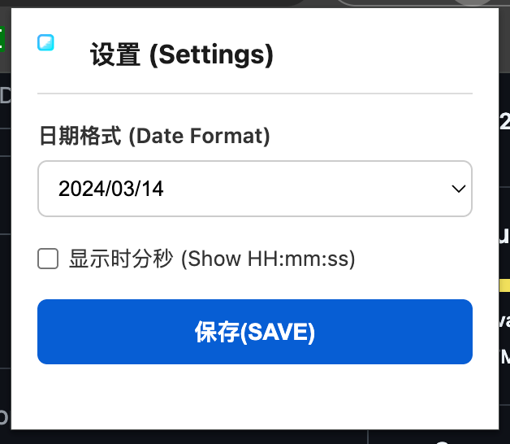

# YouTube Exact Date

> **作者 / Author**: Justin Xing (justinxing001@gmail.com)
> **版权 / Copyright**: Copyright (c) 2024 Justin Xing. All rights reserved.

## 简介 (Introduction)

**中文**: 
本浏览器插件用于将 YouTube 上的视频发布时间（例如“3天前”、“2年前”）原生提取并精确替换为具体的发布日期（例如“2023-10-05”）。抛弃复杂的自定义 UI，遵循原生无缝融合原则，直接改写节点文字内容。插件同时支持在“播放页详情 (Watch Page)”、“短视频模块 (Shorts)”和“首页/网格/列表视图 (Grid/List View)”工作，完全覆盖所有视频时间显示。

**English**: 
This browser extension extracts and replaces YouTube's fuzzy relative upload times (e.g., "3 days ago", "2 years ago") with the exact native release date (e.g., "2023-10-05"). It abandons complex custom UIs and adheres to the principle of seamless native integration by directly rewriting the text content of the nodes. The extension works perfectly on the Watch Page, Shorts Modules, and Home/Grid/List Views, comprehensively overriding all video time displays.

## 功能特性 (Features)

*   **100% 覆盖 (100% Coverage)**: 同时在首页推荐、播放页、搜索列表以及短视频等场景自动探测并转换时间，精准直观。(Automatically detects and converts time across Home recommendations, Watch pages, Search lists, and Shorts scenarios intuitively).

## 安装与使用 (Installation & Usage)

1. 下载或克隆本目录到您的设备上。 (Download or clone this directory to your device.)
2. 打开 Chrome / Edge / Brave 浏览器，并进入扩展管理页面 `chrome://extensions`。 (Open Chrome/Edge/Brave and navigate to the Extensions page `chrome://extensions`.)
3. 开启右上角的“开发者模式” (Developer mode)。(Toggle on "Developer mode" in the top right corner.)
4. 点击“加载已解压的扩展程序”，选择本插件目录即可完成安装。 (Click "Load unpacked" and select this extension directory to complete installation.)
